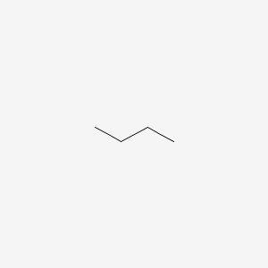
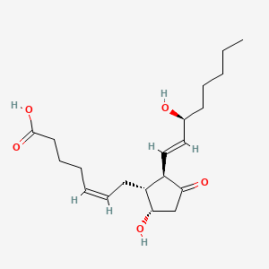

```{r setup, include=FALSE}
knitr::opts_chunk$set(echo = TRUE)
```

```{r IUPAC graphic, out.width='25%', fig.align='center', echo=FALSE}
knitr::include_graphics('book/images/iupac_and_wf.jpg')
```

## Interactive Demonstration

This notebook is intended as an interactive demonstration of the services 
being proposed by the IUPAC WorldFAIR Chemistry D3.3 project team. 
A complete description of the project is available at
<https://iupac.github.io/WFChemProtocols/intro.html>.

This notebook is an RMarkdown version of the original Jupyter Notebook, 
which is available at
<https://github.com/IUPAC/WFChemProtocols/blob/main/IUPACProtocolsDemo.ipynb>.


## Resolver Summary

While more detail is provided in the documentation linked above, in short 
what is described here is a web service called a "resolver" that performs 
two main functions:

1. Check for the presence of a chemical record in the hosting organization's database.
2. Validate the machine-readable chemical structure according to the hosting organization's rules.


## Resolver Base URL

The service being proposed in this project is a regular HTTP web service, 
using standard CGI URL syntax, and a well-defined data model for the 
information returned. This demonstration uses a prototype service hosted 
by PubChem, using JSON as the response format (although in principle it 
could be XML or any other structured data format).

One key point of this proposal is that the base URL for the resolver CGI 
would vary from one institution to another, but the inputs (CGI arguments) 
and outputs (JSON data) would be standard, the same for any organization
implementing the service. So simply by switching the base URL, one can run 
the same query on multiple different sites, without otherwise needing to 
change any code.

In R, this could look like this:

```{r preparation}
library(httr2)
resolver_base_url <- "https://pubchem.ncbi.nlm.nih.gov/resolver/resolver.cgi"
```

When called without any arguments, the resolver will return some information 
about what inputs and outputs it can handle.

```{r example with no input}
req <- request(resolver_base_url)
res <- req |> req_perform()
```

```{r display results}
# display the input and results
req$url
# display raw data
res |> resp_body_string() |> cat()
# # display as R object - suppressed for readability
# res |> resp_body_json()
```

## Chemical Lookup

The resolver service can check to see whether a given chemical is present in 
the host organization's database. Examples are below, but note that in this
interactive document, one can edit the inputs to query whatever 
chemical is desired.

First, to look up by SMILES string:

```{r request SMILES query}
req <- req |> 
  req_url_query(smiles = "CCCC") 
# perform request
res <- req |> req_perform()
```

```{r display SMILES results}
# display URL
req$url
# display raw data
res |> resp_body_string() |> cat()
# display as R object
res |> resp_body_json()
```

In this example code, the URL is first constructed using `req_url_query` and 
then encoded and retrieved using the response functions from the `httr2` package.
The resulting data indicates that there is indeed a 
matching record in the host's database, and various record fields are provided 
that would allow the user to get more information directly from the hosting 
site; this is not intended for full record retrieval, but rather a simplified
response that says whether the chemical is found and where to go to get more
detail. So in this case the user can follow the link to the full PubChem record:

<https://pubchem.ncbi.nlm.nih.gov/compound/7843>

Or see an image of the chemical structure 
(although not terribly interesting in this case!):

<!-- If html, renders live -->
<!--  -->

<!-- If PDF, use pre-downloaded file -->
```{r butane img, out.width='25%', fig.align='center', echo=FALSE}

```
<https://pubchem.ncbi.nlm.nih.gov/image/imgsrv.fcgi?t=l&cid=7843>

If the chemical is not in the database, the response would be something like 
this, where an empty result means nothing was found (this could also potentially 
be indicated by an HTTP 404 response, but is not done that way in this sample
implementation):

```{r non-existing SMILES}
req <- request(resolver_base_url) |> 
  req_url_query(smiles = "CCCC(Br)CC(F)(Cl)CCC") 
# perform request
res <- req |> req_perform()
# display
req$url
# display raw data
res |> resp_body_string() |> cat()
```

The resolver can handle multiple input formats for the chemical structure, 
as listed in the previous section. So all of these would return the same 
result, which can be verified by (un)commenting various query lines below:

```{r multiformat lookup}
# # SMILES
# req <- request(resolver_base_url) |>
#   req_url_query(smiles = "CCCC")

# InChI
req <- request(resolver_base_url) |>
  req_url_query(inchi = "InChI=1S/C4H10/c1-3-4-2/h3-4H2,1-2H3")

# # InChIKey
# req <- request(resolver_base_url) |>
#   req_url_query(inchikey = "IJDNQMDRQITEOD-UHFFFAOYSA-N")

# # Name
# req <- request(resolver_base_url) |>
#   req_url_query(name = "butane")

## Request and display results
# perform request
res <- req |> req_perform()
# display
req$url
# display raw data
res |> resp_body_string() |> cat()

```

Note that the InChI full string needs to be URL-encoded in order to be passed 
as an argument to the CGI, as would some SMILES strings with special characters.
This is handled automatically with the `httr2` functions in these examples.

## Chemical Structure Validation

The second major function of the resolver is to check the validity of chemical
structures. That is, when a user inputs a SMILES string or an SDF file (for
example, as export from some chemical drawing package or ELN), does the host
organization confirm that the structure is valid? Does it have the right number 
of defined stereocenters, isotopes, etc.? Sometimes chemists draw complex
structures in a way where stereochemistry is implied by the drawing, but may 
not be interpreted as such by a machine. This tool will allow the chemist to 
verify that the structure is perceived by the chemical software in the same 
way as by the chemist themselves.

When called with this special action argument, the resolver returns some basic
statistics about what it sees in the structure. Note this may vary somewhat from
organization to organization, especially for edge cases where different 
chemical software packages produce slightly different results. This is 
expected, and part of the idea here is to ask "What does PubChem think of 
this structure?" vs. "What does EPA think of this structure?"

```{r validate butane}
req <- request(resolver_base_url) |> 
  req_url_query(smiles = "CCCC") |>
  req_url_query(action = "validate_structure")
# perform request
res <- req |> req_perform()
# display
req$url
# display raw data
res |> resp_body_string() |> cat()
```

If there is a problem with the input structure, there should some 
human-readable message that indicates what the error is. Again this will 
vary by organization, the message itself is not part of this standard, 
but basic things like valence checks on organic structures will presumably 
be handled similarly.

```{r invalid structure}
req <- request(resolver_base_url) |> 
  req_url_query(smiles = "CC(C)(C)(C)C") |>
  req_url_query(action = "validate_structure")
# perform request
res <- req |> req_perform()
# display
req$url
# display raw data
res |> resp_body_string() |> cat()
```

Here is an example where the organization's specific rules come into play. 
PubChem, which is designed mainly for drug-like chemicals, rejects isotopes 
with half-life less than 1 millisecond. This may not be the case for other
databases with different purposes and goals. So even though 5H exists 
(at least in a laboratory), it's not considered valid in PubChem.

```{r 5H invalid in PubChem}
req <- request(resolver_base_url) |> 
  req_url_query(smiles = "C[5H]") |>
  req_url_query(action = "validate_structure")
# perform request
res <- req |> req_perform()
# display
req$url
# display raw data
res |> resp_body_string() |> cat()
```

Here is a more complex example, a larger structure (Prostaglandin D_2) with 
multiple stereocenters, both sp3 and sp2. Note the response data indicates 
how many defined vs. undefined stereocenters are present, which may assist 
the user in matching their expectations to the machine result.

```{r Prostaglandin}
## note that the SMILES will not work directly, an escape character is
## needed for the "\C"
#input_smiles <- "CCCCC[C@@H](/C=C/[C@@H]1[C@H]([C@H](CC1=O)O)C/C=C\CCCC(=O)O)O"
input_smiles <- "CCCCC[C@@H](/C=C/[C@@H]1[C@H]([C@H](CC1=O)O)C/C=C\\CCCC(=O)O)O"
req <- request(resolver_base_url) |> 
  req_url_query(smiles = input_smiles) |>
  req_url_query(action = "validate_structure")
# perform request
res <- req |> req_perform()
# display
req$url
# display raw data
res |> resp_body_string() |> cat()
```

Finally, it may be helpful to chemists, who are trained to interpret chemical
structures visually, to see a computer-generated image of their input, again 
to see if it matches what the chemist thinks should be there. So the resolver 
can also return an image file, with an appropriate output format request. 
Note, the image display uses the resolver URL directly.

```{r display Prostaglandin}
input_smiles <- "CCCCC[C@@H](/C=C/[C@@H]1[C@H]([C@H](CC1=O)O)C/C=C\\CCCC(=O)O)O"
req <- request(resolver_base_url) |> 
  req_url_query(smiles = input_smiles) |>
  req_url_query(action = "validate_structure") |>
  req_url_query(format = "png")
# perform request
res <- req |> req_perform()
# display
req$url
# display png
knitr::include_graphics(req$url)
# # for PDF display, have to use a saved image: 
# 
```


## Conclusion

It is our hope this this notebook provides a clear overview of the expected
functionality of the resolver being proposed by this IUPAC project. 
These working examples should give the user a chance to see how to submit 
these web service requests, without having to know any programming, and to 
be able to change the inputs with their own SMILES strings etc. in order to 
see how the resolver responds to their unique cases.

This R Markdown version was produced by [schymane](https://github.com/schymane/)
based on the Jupyter Notebook committed by 
[PaulThiessen](https://github.com/IUPAC/WFChemProtocols/commits?author=PaulThiessen) on [6 Oct. 2023](https://github.com/IUPAC/WFChemProtocols/commit/d5d01c131c87e41703af19f3b28756595c7e92ee).

We would be happy to get feedback, please see here for details. Thank you!

https://iupac.github.io/WFChemProtocols/demo.html


