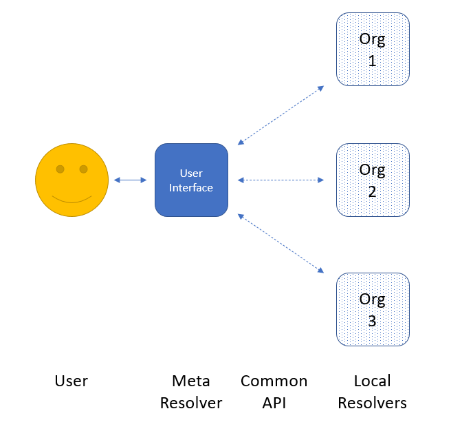

# Architecture & Data Model 

The proposed design of the global resolver is fairly straightforward, and has three main components: a shared data model for information exchange, a local resolver implemented and hosted by each participating organization, and a central "meta resolver" that communicates with the local resolvers and provides the web page interface that the user interacts with directly. In brief, the user would enter a query, and the meta resolver would send that query to each local resolver in its list (presumably in parallel). Each local resolver would perform the lookup within their system, and respond back to the meta resolver which would gather all the responses to present to the user. The most important part would be for the user to be able to clearly understand which organizations are responding, and to have links to follow through to those resources for more detail. In this way, the meta resolver does not need to know what each resource's full record contains, or to try to present each such heterogeneous record in a common way. All it needs to know is "this organization has information on this chemical" and it is then up to the user to decide where to go from there.



## Common Data Model

If this system is to be practical to implement across multiple databases all over the world, with new participants to be added at any time and without great effort, there must be a common "language" that is used for communications between the central meta resolver and the individual organizations' local resolvers. It should use generic common standards for communications and the data model, that are not dependent on any particular host platform or programming language or database system. This simplifies the meta resolver because it uses exactly the same method to communicate with each organization, and frees individual organizations to implement their local component in whatever way is most convenient for them given their existing infrastructure.

What is proposed here – but is certainly open to change – uses the HTTP protocol for communications, with normal CGI arguments for input, and then a simple JSON construct for the response data. These two standards are universal enough that programmers using just about any platform should have access to the data parsers and communications tools needed to implement this service.

Parenthetical note: PubChem has a very simple data model for this written in XML schema, as NCBI has (publicly available) software to read and write equivalent JSON or XML (or ASN.1 historically used by NCBI) based on a single schema. This schema, in its prototype form, is used to construct the examples in the next section, and is available at

[https://pubchem.ncbi.nlm.nih.gov/resolver/resolver\_data.xsd](https://pubchem.ncbi.nlm.nih.gov/resolver/resolver_data.xsd)

But the final implementation, if it uses JSON, should probably use a JSON-native format like JSON Schema ([https://json-schema.org/draft/2020-12/json-schema-core.html](https://json-schema.org/draft/2020-12/json-schema-core.html) - although that is still under development). Or, the data format of choice for this whole system could be XML instead. Regardless, there should be some way to make it clear to developers what the structure of the data should be, and make it possible to validate the JSON data automatically. These details, and whether to use HTTP or some other protocol, are not inherently critical to the overall design of this system, but would be important to work out before individual organizations begin work on their implementations.

## Local Resolver

Each individual organization that wants to participate in this global search would have to implement their own resolver, hosted on their local system. As stated earlier, just how they implement it is not relevant, so long as it follows the common rules of the communications protocol. The local resolver would need to be able to interpret the query chemical structure and perform the search in their system, responding essentially with "here is a summary of what I know about this chemical" or else "I don't have this chemical in my database."

There is available a sample implementation by PubChem. For example, each of these URLs produce the same output, from different representations of the input structure of butane (SMILES, InChIKey, InChI, and name, respectively):

[https://pubchem.ncbi.nlm.nih.gov/resolver/resolver.cgi?smiles=CCCC](https://pubchem.ncbi.nlm.nih.gov/resolver/resolver.cgi?smiles=CCCC)

[https://pubchem.ncbi.nlm.nih.gov/resolver/resolver.cgi?inchikey=IJDNQMDRQITEOD-UHFFFAOYSA-N](https://pubchem.ncbi.nlm.nih.gov/resolver/resolver.cgi?inchikey=IJDNQMDRQITEOD-UHFFFAOYSA-N)

[https://pubchem.ncbi.nlm.nih.gov/resolver/resolver.cgi?inchi=InChI%3D1S%2FC4H10%2Fc1-3-4-2%2Fh3-4H2%2C1-2H3](https://pubchem.ncbi.nlm.nih.gov/resolver/resolver.cgi?inchi=InChI%3D1S%2FC4H10%2Fc1-3-4-2%2Fh3-4H2%2C1-2H3) (note that the full InChI is URL-encoded because it contains special characters)

[https://pubchem.ncbi.nlm.nih.gov/resolver/resolver.cgi?name=butane](https://pubchem.ncbi.nlm.nih.gov/resolver/resolver.cgi?name=butane)

These all give the JSON response:

```
{

"Result": {

"Match": [

{

"Resource": "PubChem",

"ResourceURL": "https://pubchem.ncbi.nlm.nih.gov",

"ResourceIdentifier": "7843",

"ResourceIdentifierType": "CID",

"RecordURL": "https://pubchem.ncbi.nlm.nih.gov/compound/7843",

"ImageURL": "https://pubchem.ncbi.nlm.nih.gov/image/imgsrv.fcgi?t=l&cid=7843",

"IUPACName": "butane",

"SMILES": "CCCC",

"InChI": "InChI=1S/C4H10/c1-3-4-2/h3-4H2,1-2H3",

"InChIKey": "IJDNQMDRQITEOD-UHFFFAOYSA-N"

}

]

}

}
```

The key parts of this response data are the identity of the organization ( **Resource** and **ResourceURL** ), the identifier used by this organization for this chemical ( **ResourceIdentifier** and **ResourceIdentifierType** ), a link to the organization's full detail page ( **RecordURL** ), a link to an image ( **ImageURL** ), and other standard identifiers for this chemical according to this organization ( **IUPACName** , **SMILES** , **InChI** , **InChIKey** ). The meta resolver (described more below) would then be able to take this simple response from each organization, and present the information to the user presumably in some sort of tabular format.

It's possible a database may not contain the given input identifier, in which case an empty list could be produced, or else some to-be-determined explicit "not found" message:

[https://pubchem.ncbi.nlm.nih.gov/resolver/resolver.cgi?inchikey=XXXNQMDRQITEOD-UHFFFAOYSA-N](https://pubchem.ncbi.nlm.nih.gov/resolver/resolver.cgi?inchikey=XXXNQMDRQITEOD-UHFFFAOYSA-N)

```
{

"Result": {

}

}
```

Some reasonable (human-readable) error message should be produced if the input cannot be interpreted – erroneous SMILES, invalid InChI format, and such. But the details of these error reports should be left to the individual responder, as it is too complex to enforce a common reporting standard in such cases due to different software toolkits, algorithms, etc.

There are many different ways to provide chemical structure as input, and not every resource would be able to handle every type. For example, some organizations may not have the ability to interpret SMILES as input, because it requires some degree of chemical information processing to do correctly (meaning, it's not a simple string match). There should be some way for each organization to indicate which input methods it supports. Similarly, some databases may not have individual record web pages for each chemical, or may not have IUPAC-style names for each chemical, etc., so available outputs should also be provided in some way. For example, if called with no parameters at all, this prototype will respond with:

[https://pubchem.ncbi.nlm.nih.gov/resolver/resolver.cgi](https://pubchem.ncbi.nlm.nih.gov/resolver/resolver.cgi)

```
{

"Result": {

"ServiceDetails": [

{

"Resource": "PubChem",

"ResourceURL": "https://pubchem.ncbi.nlm.nih.gov",

"ResolverURL": "https://pubchem.ncbi.nlm.nih.gov/resolver/resolver.cgi",

"AvailableInputs": {

"SDF": true,

"SMILES": true,

"InChI": true,

"InChIKey": true,

"PNG": false,

"Name": true

},

"AvailableOutputs": {

"IUPACName": true,

"SMILES": true,

"InChI": true,

"InChIKey": true,

"ResourceIdentifier": true,

"RecordURL": true,

"ImageURL": true

}

}

]

}

}
```

Note the **AvailableInputs** and **AvailableOutputs** fields, which say what inputs and outputs this local resolver can handle. In this case, PubChem is saying that it can't take an image (PNG) as input, but other resources may have the ability to convert chemical drawings to structure. And this does not mean that every record will necessarily have all of these output fields – some records in PubChem for instance may have a SMILES but not a (computed) IUPAC name. But at least one of the outputs should be specified for each record, otherwise there would be nothing to show to the user.

Another key field here is the **ResolverURL** , which is the base URL of the organization's CGI that implements this protocol; that will be important to the meta resolver.

## Meta Resolver

The last major component of this design, and the only part the user would interact with directly, is the "meta resolver" – the web page that takes user input, performs the search, and presents results back to the user. The general idea is that the meta resolver would have built into it a list of all available local resolvers. When the user submits a query, the meta resolver would (presumably in parallel) send requests to each local resolver based on that input, wait for results to be returned, and then show some sort of table of responding organizations with hyperlinks back to their record pages. This is feasible for any number of participating organizations because the HTTP request is _exactly the same_ for each resource in the list, varying only by the base URL of the request ( **ResolverURL** above). Of course, the meta resolver would need to know that if, for example, the user supplies SMILES as input, that it would only send requests to local resolvers that implement SMILES as an input method. And as the response data from each local resolver is in _exactly the same_ JSON format, the meta resolver would easily be able to parse the results from each organization, without needing to know anything about the details of that organization's internal data structures, algorithms, etc. This makes the programming of the meta resolver relatively straightforward.

( **Note:** there is not currently any prototype implementation of the meta resolver.)

Central to the meta resolver is the list of local resolvers, those organizations participating in the "global search." If there are to be dozens (eventually hundreds?) of such organizations, it seems there must be some way for them to self-register in some central location, without a great deal of human intervention necessary. On the other hand, there should be some basic vetting process to ensure that each resource is legitimate. Upon whom this task falls, and the policies they would follow, are not yet determined.

Similarly, we will need to decide who will implement this meta resolver and store the master list of contributing organizations, and where it will be hosted. It should probably not be the provenance of any one contributing group (possible conflict of interest). Can/should this be handled by IUPAC? Or some other third party? This will need further discussion.
